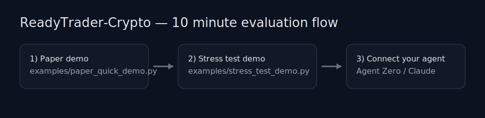

# ReadyTrader-Crypto

[](https://github.com/up2itnow/ReadyTrader-Crypto/actions/workflows/ci.yml)
[](LICENSE)

## Important Disclaimer (Read Before Use)

ReadyTrader-Crypto is provided for informational and educational purposes only and does not constitute financial, investment, legal, or tax advice. Trading digital assets involves substantial risk and may result in partial or total loss of funds. Past performance is not indicative of future results. You are solely responsible for any decisions, trades, configurations, supervision, and the security of your keys/credentials. ReadyTrader-Crypto is provided “AS IS”, without warranties of any kind, and we make no guarantees regarding profitability, performance, availability, or outcomes. By using ReadyTrader-Crypto, you acknowledge and accept these risks.

See also: `DISCLAIMER.md`.

---

---

## 🌎 The Big Picture

**ReadyTrader-Crypto** is a specialized bridge that turns your AI Agent (like Gemini or Claude) into a professional crypto trading operator. 

Think of it this way: Your AI agent provides the **Intelligence** (analyzing charts, news, and sentiment), while ReadyTrader-Crypto provides the **Hands** (connecting to exchanges) and the **Safety Brakes** (enforcing your risk rules). It allows you to delegate complex trading tasks to an AI without giving it unchecked access to your funds.

## 🛡️ The Trust Model: Intelligence vs. Execution

The core philosophy of this project is a strict separation of powers:

*   **The AI Agent (The Brain):** Decides *what* and *when* to trade. It can research historical data, scan social media, and simulate strategies, but it has no direct power to move money.
*   **The MCP Server (The Guardrail):** Owns the API keys and enforces your safety policies. It filters every AI request through a "Risk Guardian" that rejects any trade that is too large, too risky, or violates your personal limits.

## 🔄 A Day in the Life of a Trade

1.  **Research:** You ask your agent, "Find a good entry for BTC." The agent calls `fetch_ohlcv` and `get_sentiment`.
2.  **Proposal:** The agent concludes, "BTC is oversold; I want to buy $100." It calls `place_limit_order`.
3.  **Governance:** The MCP server checks its rules. Is $100 within your `MAX_TRADE_AMOUNT`? If yes, it creates a **Pending Execution**.
4.  **Consent:** If you've enabled "Human-in-the-loop," the agent notifies you. You click **Confirm** in the [Web UI](#-optional-web-ui), and only then does the trade hit the exchange.

---

### 🖥️ Premium Next.js Dashboard

`ReadyTrader-Crypto` includes a professional Next.js dashboard for real-time monitoring, multi-agent coordination, and trade approvals.

**How to Enable:**
1.  Navigate to the directory: `cd frontend`
2.  Install dependencies: `npm install`
3.  Run the development server: `npm run dev`
4.  Access it at `http://localhost:3000`.

**Features:**
-   **Real-time Tickers**: Low-latency price streaming via WebSockets.
-   **Multi-Agent Insights**: Shared "Market Insights" for collaborative research.
-   **Mobile Guard**: Push notifications for trades requiring manual approval.
-   **Glassmorphic UI**: High-performance charting and portfolio visualization.

---

## 🚀 Key Features

*   **📉 Paper Trading Simulator**: Zero-risk practice environment with persistent balances and realistic order handling.
*   **🧠 Strategy Factory**: Built-in Backtesting Engine with a **Strategy Marketplace** for saving and sharing agent configurations.
*   **🏦 Deep DeFi Integration**: Direct support for **Aave V3** (Lending) and **Uniswap V3** (Concentrated Liquidity).
*   **🛡️ Risk Guardian**: Hard-coded safety layer. Automatically rejects trade requests that violate risk rules.
*   **🤝 Multi-Agent Orchestration**: Support for "Researcher" and "Executor" agent handoffs via a shared **Insight Store**.
*   **📰 Advanced Intelligence**: Real-time sentiment feeds from X, Reddit, and News APIs with local NLP fallbacks.

---

## ⚡ 10-minute evaluation (Phase 6)

Run both demos locally (no exchange keys, no RPC needed):

```bash
python examples/paper_quick_demo.py
python examples/stress_test_demo.py
```

You’ll get exportable artifacts under `artifacts/demo_stress/` (gitignored).

Prompt pack (copy/paste): `prompts/READYTRADER_PROMPT_PACK.md`.



## 🛠️ Installation & Setup

### Prerequisites
*   Docker (Docker Compose optional)

### 1. Build & Run (Standalone)
Run the server in a container. It exposes stdio for MCP clients.
```bash
cd ReadyTrader-Crypto
docker build -t readytrader-crypto .
# Run interactively (to test)
docker run --rm -i readytrader-crypto
```

### Local development (no Docker)
If you want to run or test ReadyTrader-Crypto locally:

```bash
pip install -r requirements-dev.txt
python app/main.py
```

### 2. Configuration (`.env`)

Create a `.env` file or pass environment variables. Start from `env.example` (copy to `.env`).

<details>
<summary><b>🛡️ Live Trading Safety & Approval</b></summary>

| Variable | Default | Description |
| :--- | :--- | :--- |
| `PAPER_MODE` | `true` | Set to `false` for live trading. |
| `LIVE_TRADING_ENABLED` | `false` | Must be `true` for any live execution. |
| `TRADING_HALTED` | `false` | Global kill switch to halt all live actions. |
| `EXECUTION_APPROVAL_MODE` | `auto` | `auto` executes immediately; `approve_each` requires manual confirmation. |
| `API_PORT` | `8000` | Port for the FastAPI/WebSocket server (`api_server.py`). |
| `DISCORD_WEBHOOK_URL`| `""` | Optional webhook for trade approval notifications. |
</details>

<details>
<summary><b>🔑 Exchange & Signing Credentials</b></summary>

| Variable | Description |
| :--- | :--- |
| `PRIVATE_KEY` | Hex private key for signing (if `SIGNER_TYPE=env_private_key`). |
| `CEX_API_KEY` | API Key for your primary exchange. |
| `CEX_API_SECRET` | API Secret for your primary exchange. |
| `SIGNER_TYPE` | `env_private_key`, `keystore`, or `remote`. |
| `CEX_BINANCE_API_KEY` | Exchange-specific keys (e.g., `CEX_BINANCE_...`). |
</details>

<details>
<summary><b>📈 Market Data & CCXT Tuning</b></summary>

| Variable | Default | Description |
| :--- | :--- | :--- |
| `MARKETDATA_EXCHANGES` | `binance...` | Comma-separated list of exchanges to use for data. |
| `TICKER_CACHE_TTL_SEC` | `5` | How long to cache price data. |
| `DEX_SLIPPAGE_PCT` | `1.0` | Default slippage for DEX swaps. |
| `ALLOW_TOKENS` | `*` | Comma-separated allowlist of tradeable tokens. |
</details>

<details>
<summary><b>🛠️ Ops, Observability & Limits</b></summary>

| Variable | Default | Description |
| :--- | :--- | :--- |
| `RATE_LIMIT_DEFAULT_PER_MIN` | `120` | Default API rate limit. |
| `RISK_PROFILE` | `conservative`| Presets for sizing and safety limits. |
| `ALLOW_CHAINS` | `ethereum...` | Allowlists for EVM networks. |
</details>

---

#### CEX credentials (Phase 3)
To place CEX orders or fetch CEX balances, configure ccxt credentials via env.

Generic (applies to the default exchange you pass to the tool):
* `CEX_API_KEY=...`
* `CEX_API_SECRET=...`
* `CEX_API_PASSWORD=...` (optional; some exchanges)

Or per-exchange (preferred):
* `CEX_BINANCE_API_KEY=...`
* `CEX_BINANCE_API_SECRET=...`
* `CEX_BINANCE_API_PASSWORD=...` (optional)

Tools:
* `place_cex_order(symbol, side, amount, order_type='market', price=None, exchange='binance', market_type='spot', idempotency_key='')`
* `get_cex_balance(exchange='binance', market_type='spot')`
* `get_cex_order(order_id, symbol='', exchange='binance', market_type='spot')`
* `cancel_cex_order(order_id, symbol='', exchange='binance', market_type='spot')`
* `get_cex_capabilities(exchange='binance', symbol='', market_type='spot')`
* `list_cex_open_orders(exchange='binance', symbol='', market_type='spot', limit=100)`
* `list_cex_orders(exchange='binance', symbol='', market_type='spot', limit=100)`
* `get_cex_my_trades(exchange='binance', symbol='', market_type='spot', limit=100)`
* `cancel_all_cex_orders(exchange='binance', symbol='', market_type='spot')`
* `replace_cex_order(exchange, order_id, symbol, side, amount, order_type='limit', price=None, market_type='spot')`
* `wait_for_cex_order(exchange, order_id, symbol='', market_type='spot', timeout_sec=30, poll_interval_sec=2.0)`

Market-data introspection:
* `get_marketdata_capabilities(exchange_id='')`

---

## 🔌 Integration Guide

### Option A: Agent Zero (Recommended)
To give Agent Zero these powers, add the following to your **Agent Zero Settings** (or `agent.yaml`).
The MCP server key/name is arbitrary; we use `readytrader_crypto` in examples.

Quick copy/paste file: `configs/agent_zero.mcp.yaml`.

**Via User Interface:**
1.  Go to **Settings** -> **MCP Servers**.
2.  Add a new server:
    *   **Name**: `readytrader_crypto`
    *   **Type**: `stdio`
    *   **Command**: `docker`
    *   **Args**: `run`, `-i`, `--rm`, `-e`, `PAPER_MODE=true`, `readytrader`

**Via `agent.yaml`:**
```yaml
mcp_servers:
  readytrader_crypto:
    command: "docker"
    args: 
      - "run"
      - "-i" 
      - "--rm"
      - "-e"
      - "PAPER_MODE=true"
      - "readytrader-crypto"
```
Prebuilt config: `configs/agent_zero.mcp.yaml`.
*Restart Agent Zero after saving.*

### Option B: Generic MCP Client (Claude Desktop, etc.)
Add this to your `mcp-server-config.json`:

Quick copy/paste file: `configs/claude_desktop.mcp-server-config.json`.

```json
{
  "mcpServers": {
    "readytrader_crypto": {
      "command": "docker",
      "args": [
        "run", 
        "-i", 
        "--rm", 
        "-e", "PAPER_MODE=true", 
        "readytrader-crypto"
      ]
    }
  }
}
```
Prebuilt config: `configs/claude_desktop.mcp-server-config.json`.

---

## 📚 Feature Guide

### 1. The Strategy Builder (Backtesting)
Your agent can "research" before it trades. Ask it to **develop and test** a strategy.

**Example Prompt:**
> "Create a mean-reversion strategy for BTC/USDT. Write a Python function `on_candle` that uses RSI. Run a backtest simulation on the last 500 hours and tell me the Win Rate and PnL."

**What happens:**
1.  Agent calls `fetch_ohlcv("BTC/USDT")` to see data structure.
2.  Agent writes code for `on_candle(close, rsi, state)`.
3.  Agent calls `run_backtest_simulation(code, "BTC/USDT")`.
4.  Server runs the code in a sandbox and returns `{ "pnl": 15.5%, "win_rate": 60% }`.

### 2. Paper Trading Laboratory
Perfect for "interning" your agent.
*   **Deposit Funds**: `deposit_paper_funds("USDC", 10000)`
*   **Place Orders**: `place_limit_order("buy", "ETH/USDT", 1.0, 2500.0)`
*   **Check Status**: `get_address_balance(..., "paper")`

### 3. Market Regime & Risk
The agent can query the "weather" before flying.
*   **Tool**: `get_market_regime("BTC/USDT")`
*   **Output**: `{"regime": "TRENDING", "direction": "UP", "adx": 45.2}`
*   **Agent Logic**: "The market is Trending Up (ADX > 25). I will switch to my Trend-Following Strategy and disable Mean-Reversion."

**The Guardian (Passive Safety):**
You don't need to do anything. If the agent tries to bet 50% of the portfolio on a whim, `validate_trade_risk` will **BLOCK** the trade automatically.

---

## 🧰 Tool Reference
For the complete (generated) tool catalog with signatures and docstrings, see: `docs/TOOLS.md`.

| Category | Tool | Description |
| :--- | :--- | :--- |
| **Market Data** | `get_crypto_price` | Live price from CEX. |
| | `fetch_ohlcv` | Historical candles for research. |
| | `get_market_regime` | **Trend/Chop Detection** (Phase 6). |
| **Intelligence** | `get_sentiment` | Fear & Greed Index. |
| | `get_social_sentiment` | X/Reddit Analysis (Simulated). |
| | `get_financial_news` | Bloomberg/Reuters (Simulated). |
| **Trading** | `swap_tokens` | Execute market order swap. |
| | `place_limit_order` | **Limit Order** (Paper Mode). |
| | `check_orders` | Update Order Book (Paper Mode). |
| **Account** | `get_address_balance`| Check Wallet Balance. |
| | `deposit_paper_funds`| Get fake money (Paper Mode). |
| **Research** | `run_backtest_simulation` | **Run Strategy Backtest**. |
| **Research** | `run_synthetic_stress_test` | Run **synthetic black-swan stress test** with deterministic replay + recommendations. |

---
*Built for the Agentic Future.*

## 🧪 Synthetic Stress Testing (Phase 5)
This MCP includes a **100% randomized (but deterministic-by-seed)** synthetic market simulator. It can generate trending, ranging, and volatile regimes and inject **black swan crashes** and **parabolic blow-off tops**.

### Tool: `run_synthetic_stress_test(strategy_code, config_json='{}')`
Returns JSON containing:
- **metrics summary** across scenarios
- **replay seeds** (master + per-scenario)
- **artifacts**: CSV scenario metrics, plus worst-case equity curve CSV + trades JSON
- **recommendations**: suggested parameter changes (and applies to `PARAMS` keys if present)

Example `config_json`:
```json
{
  "master_seed": 123,
  "scenarios": 200,
  "length": 500,
  "timeframe": "1h",
  "initial_capital": 10000,
  "start_price": 100,
  "base_vol": 0.01,
  "black_swan_prob": 0.02,
  "parabolic_prob": 0.02
}
```

---

## 📌 Project docs
- `docs/README.md`: docs index / navigation
- `docs/TOOLS.md`: complete tool catalog (generated from `app/tools`)
- `docs/ERRORS.md`: common error codes and operator troubleshooting
- `docs/EXCHANGES.md`: exchange capability matrix (Supported vs Experimental)
- `docs/MARKETDATA.md`: market data routing, freshness scoring, plugins, and guardrails
- `docs/THREAT_MODEL.md`: operator-focused threat model (live trading)
- `docs/CUSTODY.md`: key custody + rotation guidance
- `docs/POSITIONING.md`: credibility-safe marketing + messaging
- `RELEASE_READINESS_CHECKLIST.md`: what must be green before distribution
- `CHANGELOG.md`: version-to-version change summary